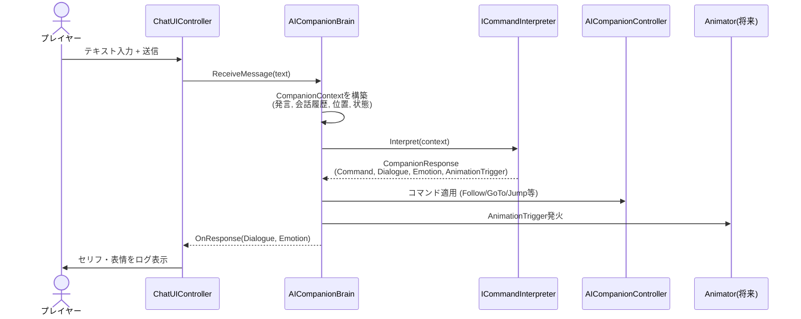

# アーキテクチャ概要

協力ランニングゲーム（プレイヤー + AI仲間）の全体構成と、各コンポーネントの責務をまとめる。
詳細な自然言語変換インターフェースの仕様は [nlp-interface.md](./nlp-interface.md) を参照。
開発ルール・命名規則は [conventions.md](./conventions.md) を参照。

## コンポーネント構成図

```mermaid
graph TD
    subgraph Input
        Player[プレイヤー操作<br/>WASD/ジャンプ]
        Chat[チャット入力<br/>ChatUIController]
    end

    subgraph PlayerSide
        PlayerController[PlayerController]
    end

    subgraph CompanionAI["AI仲間"]
        Brain[AICompanionBrain]
        Interpreter["ICommandInterpreter<br/>(Rule-based / 将来LLM)"]
        Memory["ConversationMemory<br/>(将来追加)"]
        CompanionController[AICompanionController]
    end

    subgraph Presentation
        Camera[CameraFollow]
        UI[チャットログ表示]
        Anim["Animator<br/>(将来追加)"]
    end

    Player --> PlayerController
    Chat -->|ReceiveMessage(text)| Brain
    Memory <-->|履歴の参照/追記| Brain
    Brain -->|CompanionContext| Interpreter
    Interpreter -->|CompanionResponse| Brain
    Brain -->|CompanionCommand| CompanionController
    Brain -->|セリフ/感情| UI
    Brain -->|AnimationTrigger| Anim
    PlayerController --> Camera
    PlayerController -.位置情報.-> Brain
```

## データフロー（メッセージ送信時のシーケンス）



## ディレクトリ構成

```
Assets/
├── Scripts/
│   ├── Player/
│   │   └── PlayerController.cs        # プレイヤー移動・ジャンプ
│   ├── Companion/
│   │   ├── AICompanionController.cs   # 移動の状態machine (Follow/MoveTo/Wait...)
│   │   └── AICompanionBrain.cs        # 指示解釈の起点。Interpreterを呼び出し結果を適用
│   ├── Commands/
│   │   ├── ICommandInterpreter.cs     # 自然言語変換のインターフェース (詳細はnlp-interface.md)
│   │   ├── CompanionCommand.cs        # AIへの行動指示データ
│   │   ├── CompanionResponse.cs       # Interpreterの出力全体 (将来追加)
│   │   ├── CompanionContext.cs        # Interpreterへの入力全体 (将来追加)
│   │   └── RuleBasedCommandInterpreter.cs # キーワード一致による現行実装
│   ├── UI/
│   │   └── ChatUIController.cs        # チャット入出力
│   └── Camera/
│       └── CameraFollow.cs            # 追従カメラ
├── Editor/
│   └── DemoSceneBuilder.cs            # 検証用シーンの自動構築
└── Docs/                               # このディレクトリ (設計ドキュメント)
```

## 各コンポーネントの責務

| コンポーネント | 責務 | 依存 |
|---|---|---|
| `PlayerController` | プレイヤーの移動・ジャンプ入力処理 | `CharacterController` |
| `ChatUIController` | チャットUIの入出力、`AICompanionBrain`への送信とログ表示 | `AICompanionBrain` |
| `AICompanionBrain` | 自然言語変換処理の呼び出し・結果の各システムへの分配 | `ICommandInterpreter`, `AICompanionController` |
| `ICommandInterpreter` | テキスト+文脈 → コマンド/セリフ/感情/アニメーションへの変換 | なし（差し替え可能） |
| `RuleBasedCommandInterpreter` | キーワード一致による`ICommandInterpreter`実装 | なし |
| `AICompanionController` | コマンドに基づく実際のキャラクター移動 | `CharacterController` |
| `CameraFollow` | プレイヤー追従カメラ | なし |

## 今後追加予定のコンポーネント

- `ConversationMemory`: 直近の会話履歴を保持し`CompanionContext`に渡す
- `LocalLLMCommandInterpreter`: `ICommandInterpreter`実装。ローカルLLMを使い、内部で`IPromptBuilder` → `ILocalLLMClient` → `ILLMResponseParser` → `IActionTranslator`の4要素を順に呼び出す（詳細は[nlp-interface.md](./nlp-interface.md)の「ローカルLLMパイプラインと3つのインターフェース境界」を参照）
- `Animator` 連携: `CompanionResponse.AnimationTrigger`をAnimatorのトリガーにマッピングする層

> **補足**: AI連携は外部APIではなく**ローカルLLMをゲーム内に組み込む**方針。LLM本体・プロンプト形式・出力フォーマットの更新が`AICompanionBrain`以降に波及しないよう、上記4つのインターフェースで区切る。
