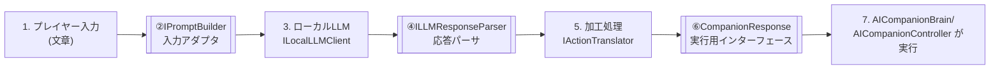

# 自然言語変換インターフェース仕様

プレイヤーのチャット入力を、AI仲間の「行動」「セリフ」「表情/感情」「アニメーション」に変換する処理（自然言語変換処理）の入出力インターフェースを定義する。
現行実装（ルールベース）と将来実装（LLMベース）が同じインターフェースに準拠することで、変換ロジックを差し替え可能にする。

全体構成は [architecture.md](./architecture.md) を参照。

## 設計方針

1. **変換処理の前後を明確に分離する**
   呼び出し側（`AICompanionBrain`）は、変換処理の内部実装（キーワード一致かLLMか）を一切意識しない。
   入力は `CompanionContext`、出力は `CompanionResponse` のみでやり取りする。

2. **入力には「文脈」を含める**
   1回のメッセージだけでなく、直近の会話履歴・プレイヤーとAI仲間の状態（位置・現在の行動）を入力に含める。
   ルールベース実装は文脈を無視してよいが、LLM実装が後から文脈を使えるよう、最初からインターフェースに含めておく。

3. **出力は「行動」「セリフ」「感情」「アニメーション」の4種類に分ける**
   - 行動: `CompanionCommand`（既存）
   - セリフ: 表示用テキスト
   - 感情: 表情/吹き出しアイコンなどに使う列挙値
   - アニメーション: Animatorのトリガー名（文字列）

4. **未知の入力やエラーは必ず`Unknown`系の値で表現し、例外を投げない**
   LLM呼び出しのタイムアウトや解析失敗時も、呼び出し側が必ず扱える形のレスポンスを返す。

## ローカルLLMパイプラインと3つのインターフェース境界

本プロジェクトでは**ローカルLLMをゲーム内に組み込む**前提とする。プレイヤーの発言からAI仲間の行動が確定するまでの流れを、以下の7ステップ・3つのインターフェース境界に分割する。各境界は、LLMモデルやランタイムの更新（バージョンアップ・モデル差し替え）が他の層に影響しないようにするための区切り。



| # | ステップ | 役割 |
|---|---|---|
| 1 | プレイヤー入力 | `CompanionContext`（発言+履歴+状態）を構築 |
| ② | `IPromptBuilder`（境界1） | `CompanionContext` → ローカルLLM用プロンプト文字列への変換 |
| 3 | ローカルLLM (`ILocalLLMClient`) | プロンプトを受け取り、生のテキスト応答を返す |
| ④ | `ILLMResponseParser`（境界2） | LLMの生応答 → 構造化された意図(`LLMIntent`)への変換 |
| 5 | 加工処理 (`IActionTranslator`) | `LLMIntent` → ゲームで実行可能な`CompanionResponse`への変換 |
| ⑥ | `CompanionResponse`（境界3） | ゲーム側が実行する最終的なデータ契約（既存の出力定義そのもの） |
| 7 | `AICompanionBrain` / `AICompanionController` | `CompanionResponse`を受け取り、移動・セリフ表示・アニメーションを実行 |

### 各インターフェースの定義

```csharp
namespace AIRunner.Commands
{
    // 境界1: ゲーム内コンテキスト → LLM入力
    public interface IPromptBuilder
    {
        string BuildPrompt(CompanionContext context);
    }

    // ステップ3: ローカルLLM呼び出し本体（モデル/ランタイムの差異を吸収）
    public interface ILocalLLMClient
    {
        Task<string> GenerateAsync(string prompt);
    }

    // 境界2: LLM生応答 → 構造化された意図
    public interface ILLMResponseParser
    {
        LLMIntent Parse(string rawResponse);
    }

    // ステップ5の入力: パース済みの意図（LLMの自由な表現を正規化前の形で保持）
    public struct LLMIntent
    {
        public string ActionName;   // 例: "follow", "jump", "goto", "unknown"
        public string DialogueText;
        public string EmotionLabel; // LLMが出力した感情表現（自由文字列）
        public Vector3? Direction;  // GoTo時の方向。LLMが示せない場合はnull
    }

    // ステップ5: 意図 → ゲーム実行可能な形式（境界3=CompanionResponseを生成する）
    public interface IActionTranslator
    {
        CompanionResponse Translate(LLMIntent intent);
    }
}
```

### なぜ3つに分けるか（更新への耐性）

- **`IPromptBuilder`を分離する理由**: ローカルLLMのモデルやバージョンを変更すると、最適なプロンプト形式（指示文の書き方・JSON出力指定の方法など）が変わることが多い。ここを分離しておけば、`CompanionContext`の作り方（`AICompanionBrain`側）には影響しない。
- **`ILocalLLMClient`を分離する理由**: ローカルLLMの実行方式（例: Ollama HTTP API、llama.cppの組み込み、将来的なランタイム変更）を切り替えても、プロンプトの作り方・応答の解釈方法には影響しない。
- **`ILLMResponseParser`を分離する理由**: モデルの出力フォーマット（JSON/プレーンテキスト/特定のタグ形式など）はモデルやバージョンによって変わりやすい。ここを分離しておけば、`IActionTranslator`以降のゲームロジックには影響しない。
- **`CompanionResponse`（境界3）を分離する理由**: 既存のルールベース実装と完全に同じ契約にすることで、`AICompanionBrain`/`AICompanionController`はLLMかルールベースかを意識しなくてよい（既存の`ICommandInterpreter`の出力定義をそのまま再利用）。

### LocalLLMCommandInterpreter（合成例）

`ICommandInterpreter`の実装として、上記4要素を内部で順に呼び出すのみ。

```csharp
namespace AIRunner.Commands
{
    public class LocalLLMCommandInterpreter : ICommandInterpreter
    {
        private readonly IPromptBuilder promptBuilder;
        private readonly ILocalLLMClient llmClient;
        private readonly ILLMResponseParser responseParser;
        private readonly IActionTranslator actionTranslator;

        public async Task<CompanionResponse> InterpretAsync(CompanionContext context)
        {
            string prompt = promptBuilder.BuildPrompt(context);
            string raw = await llmClient.GenerateAsync(prompt);
            LLMIntent intent = responseParser.Parse(raw);
            return actionTranslator.Translate(intent);
        }
    }
}
```

`ICommandInterpreter.Interpret`を非同期化する必要がある点は「移行手順」の項目4と対応する。ローカルLLMは応答に数百ms〜数秒かかる想定のため、`AICompanionBrain`側は応答待ちの間の一時セリフ/アニメーションを表示する設計とする。

## データ構造

### CompanionContext（入力）

変換処理に渡す情報全体。

```csharp
namespace AIRunner.Commands
{
    public struct CompanionContext
    {
        // 今回のプレイヤー発言
        public string PlayerMessage;

        // 直近の会話履歴（古い順）。実装によっては無視してよい
        public IReadOnlyList<ConversationTurn> History;

        // 現在の状態（位置・行動）
        public Vector3 PlayerPosition;
        public Vector3 CompanionPosition;
        public CompanionState CompanionState;
    }

    public struct ConversationTurn
    {
        public ConversationSpeaker Speaker; // Player or Companion
        public string Text;
    }

    public enum ConversationSpeaker
    {
        Player,
        Companion
    }
}
```

- `History` は `ConversationMemory`（後述）が保持するリングバッファを参照渡しする想定。件数の上限は`ConversationMemory`側で管理する。
- `PlayerPosition` / `CompanionPosition` はGoToコマンドの方向計算や、LLMへの状況説明（「プレイヤーは前方にいる」等）に使う。

### CompanionResponse（出力）

変換処理からの応答全体。

```csharp
namespace AIRunner.Commands
{
    public struct CompanionResponse
    {
        public CompanionCommand Command;
        public string DialogueText;
        public EmotionType Emotion;
        public string AnimationTrigger; // Animatorのトリガー名。未指定はnull/空文字
    }

    public enum EmotionType
    {
        Neutral,
        Happy,
        Excited,
        Confused,
        Worried,
        Apologetic
    }
}
```

- `AnimationTrigger` はAnimator Controller側で定義したトリガー名と一致させる文字列。実装側（`AICompanionBrain`またはAnimator連携層）が未知のトリガー名を無視できるようにする。
- `EmotionType` の値が増える場合はこのファイルと該当実装（ルールベース/LLM）の両方を更新する。

### CompanionCommand（行動指示・既存）

```csharp
namespace AIRunner.Commands
{
    public enum CommandType
    {
        Follow,
        Stop,
        Wait,
        Jump,
        GoTo,
        Unknown
    }

    public struct CompanionCommand
    {
        public CommandType Type;
        public Vector3 Direction; // GoTo時の方向
        public string RawText;
    }
}
```

既存の構造を変更せず、`CompanionResponse`の一フィールドとして内包する。

### ICommandInterpreter（変換処理インターフェース）

```csharp
namespace AIRunner.Commands
{
    public interface ICommandInterpreter
    {
        CompanionResponse Interpret(CompanionContext context);
    }
}
```

## 実装ガイドライン

### RuleBasedCommandInterpreter（現行）

- `context.PlayerMessage` のみを使用し、`History`/位置情報は無視してよい。
- `CompanionResponse.Emotion` はコマンド種別に応じた固定値を返す（例: `Jump`→`Excited`, `Unknown`→`Confused`）。
- `AnimationTrigger` はコマンド種別に応じた固定文字列（例: `Jump`→`"Jump"`, `Follow`→`"Wave"`）。未対応のうちは空文字でよい。

### LLMCommandInterpreter（将来実装）

- `context` をプロンプトに変換し、LLMにJSON形式で`CompanionResponse`相当を出力させる。
- 受け取ったJSONのパースに失敗した場合・タイムアウトした場合は、`CommandType.Unknown` + `EmotionType.Confused` のフォールバック`CompanionResponse`を返す（例外を投げない）。
- レイテンシ対策として、`AICompanionBrain`側で「考え中」のような一時セリフ・アニメーションを即時表示し、LLM応答到着後に本来の`CompanionResponse`で上書きする非同期フローを想定する（`Interpret`を`async`/コルーチン対応にする変更が必要）。
- API呼び出しは1メッセージ＝1リクエストを基本とし、`History`の件数はトークン数を考慮して直近5〜10件程度に制限する。

## 移行手順（ルールベース → LLM）

1. `CompanionContext` / `CompanionResponse` / `EmotionType` を定義（`ICommandInterpreter`は本仕様の形に拡張）。
2. `RuleBasedCommandInterpreter` を新インターフェースに合わせて更新（`Emotion`/`AnimationTrigger`を追加で返すのみで、既存ロジックは変更不要）。
3. `ConversationMemory` を実装し、`AICompanionBrain`が`CompanionContext`を構築する際に履歴を渡す。
4. `AICompanionBrain.ReceiveMessage`を非同期対応にし、`LLMCommandInterpreter`を実装・差し替え。
5. Animator連携層を実装し、`CompanionResponse.AnimationTrigger`を反映する。

各ステップは独立して動作確認可能な単位とし、既存のルールベース動作を壊さないことを確認しながら進める。
